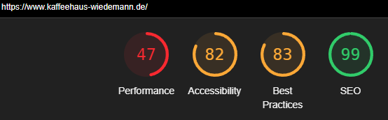

## Wie ist dieses Dokument zu verstehen?

 Diese Vorschläge sind nur Sachen, die **aktiv** Geld einbringen für die Firma. Es gibt noch weitaus mehr Sachen die im Hintergrund optimiert werden können, jedoch nicht direkt Geld machen, z.B. Website erneuern, CRM Tool (Notion) auf euch abstimmen, Social Media Posting Pipeline einrichten und anderes. Jedoch habe ich sie bewusst weggelassen, falls euch da auch eine genauere Auflistung interessiert, gebt mir Bescheid.

 Die Beispiele sind alles real Seiten und Probleme die ich mit Google Maps im Umkreis von Deggendorf Zentrum in kürzester Zeit gefunden habe.

 Alle Texte, die [so aussehen](example.org), verlinken auf Websites.

 Zahlen, die hochgestellt[^1] sind, Verlinkungen auf Bildern, die sich auf den Text beziehen. Die Bilder sind auch am Ende des Dokuments zu finden.

## Webseiten für Kunden verwalten 

### *Was genau?*
 Betreuung von bereits bestehenden Websites, um sie auf den aktuellen Stand zu bringen und auch zu optimieren. Eine bessere Einrichtung für die Kunden ermöglichen, um selbst Posts (z.b. Neuigkeiten) besser und schneller erstellen zu können. Oder Daten, die auf der Website falsch sind, zu aktualisieren.

### *Beispiel*

  [Kaffee Wiedemann](https://www.kaffeehaus-wiedemann.de/) hat eine Wordpres Seite mit Elementor (kann man im HTML Document der Website auslesen) die Performance auf PC ist gut aber auf Handys grauenhaft[^2].
  Die Werte wurden mit [Google Lighthouse](https://developer.chrome.com/docs/lighthouse/overview/) errechnet.
 
  Es ist kein Problem es zu optimieren und auch nicht viel Aufwand (schlechte Performance liegt hauptsächlich daran wie die Bilder laden und welche benutzt werden). 

---
---
 
 

## Webseite neu aufbauen

### *Was genau?*
 Viele haben zwar eine eigene Seite, aber dann oft 5 Jahre oder älter. Da der Content (Texte und Bilder, Grundidee) schon steht, ist es relativ einfach, die Website moderner zu gestalten.

### *Beispiel*

 [Gück Optik](https://www.optik-gueck.de/) hat zwar eine Seite, aber nicht mobile optimiert und ich denke auch, dass es lange her ist, seitdem dort neuer Content hochgeladen wurde. 

---
---
 
 

## Webseite komplett neu erstellen

### *Was genau?*
 Die Website komplett aufsetzen. Es wäre von Vorteil, bevor es wirklich in HTML, CSS, JS umgesetzt wird, eine grobe Vorgabe gibt, wie es aussehen sollte. Denn sonst kann sich so ein Entwicklungsprozess sehr schnell über Monate hinziehen. Auch ist es wichtig, dass nicht zu große Projekte angenommen werden, da es sonst schwierig wird, es in einem zeitlich angemessenen Rahmen fertig zu bekommen. Siehe Beispiele welche "Größe" von Websiten gehen und welche nicht.

### *Beispiel*

 Machbare größe: [Kook36](https://kook36.de/), [Maximilians](https://maximilians-restaurant.de/), [Schäfer](https://zweisinne.de/), [Optik Stock](https://www.optik-stock.de/), [MiniBar](https://minibar-deggendorf.de/)

 Nicht machbar: [Höttl](https://www.hoettl.de/), [Kochlöffel](https://www.kochloeffel.de/), [FahrradFixX](https://www.fahrradfixx.de/), [Lichtspielhaus](https://www.lichtspielhaus.com/), [AdLink](https://www.adlinktech.com/)

---
---
 
 

## Funnels

### *Was genau?*

 Im Prinzip genau das was ich für Kutz & Prem schon gemacht habe. Nur eben auch mit Einrichtung von Datenpipelines um die gewonnen Kundendaten mit möglichst wenig menschlicher Hilfe weiter zu verarbeiten und an den Kunden zu geben und auch die Daten visuell schöner aufzubereiten (damit der Kunde keine [JSON](https://json.org/example.html) anschauen muss).

### *Beispiel*

 [Kutz & Prem Funnel](giant-pilot.localsite.io) (läuft zur Zeit noch über meinen lokalen PC. Heißt ich muss das Programm starten falls es angeschaut werden will). Funnel in Bildformat[^3] ist aber am Ende des Dokuments zu finden.

---
---
 
 

## Einrichtung und Erklärung von AI 

### *Was genau?*

 Ich habe bereits z.B. eigene Modells für [Stable Diffusion](https://github.com/CompVis/stable-diffusion) (Bildgeneration) erstellt und viel mit dem beliebtesten [Web UI](https://github.com/AUTOMATIC1111/stable-diffusion-webui) für Stable Diffusion gearbeitet. Auch hab ich bereits mit meine Bruder einen kleines PDF Q&A Programm mit [OpenAI API](https://github.com/openai/openai-python) (ChatGPT) und anderen Machine Learning Libraries erstellt. Solche Sachen gezielt dann für Kunden einzurichten und die stärken und schwächen zu zeigen wäre möglich.

### *Beispiel*

 Ich gehe mal davon aus, dass Kutz & Prem viel mit Excel arbeitet. Es wäre möglich ChatGPT zu implementieren um komplexe Formeln mit hilfe von AI zu erstellen und das direkt in Excel selbst.

 Für ein Tattoo Studio ein Image Generation Modell erstellen aus ihren eigenen bereits gemachten Tattoos, damit sie leichter Ideen testen können und dann aus der AI generierten Vorlage, das tatsächliche Tattoo zu designen.

---
---
 
 

## Betreuung und Hilfe bei IT Fragen und Kleinigkeiten

### *Was genau?*

 Allgemeine Hilfe bei technischen Fragen, die meist nicht wirklich aufwändig sind, zu fixen oder zu erklären. Jedoch ohne Hintergrundwissen in IT so gut wie Unmöglich zu lösen sind.

 Solche Sachen machen wahrscheinlich am meisten Sinn als Zusatz anzubieten zu anderen Paketen. Z.B. für Firmen, deren Insta oder FB Account ihr bereits verwaltet auch sagen, dass bei solchen Fragen sie sich bei euch melden können.

### *Beispiel*

 Probleme oder Inkonsistenzen wie ihr z.B. mit euren Domains habt (Website: socialmarketingtheresia.de, Email: socialmarketing-theresia.de) sind leicht zu ändern und haben viele kleinere Firmen.

 [Tauscher GmbH](https://www.tauscher-gmbh.de/) hat ein abgelaufenes SSL Zertifikat, deswegen kommt eine große Warnung[^4] (Bild am Ende des Dokuments) was denke ich mal viele Kunden abschreckt. Es ist nicht schwer zu fixen.

---
---
 
 

## Weitere Ideen

### *Was genau?*

 Das hier sind Ideen, die mir noch einfallen, aber ich entweder nicht sicher bin ob ich es gut genug kann und erst weiter lernen müsste oder es in einem zeitlich angemessenen Rahmen alleine zu bewältigen ist.

### *Beispiel*

 - Entwicklung kleinerer interner Tools für Kunden
 - Betreuung von Onlineshops
 - komplexere Bildbearbeitung die mit SaaS wie Canva nicht möglich sind mit [GIMP](https://www.gimp.org/)
 - Vektorisierung und allgemeine Arbeit mit SVG's von z.B. Logos mit [InkScape](https://inkscape.org/)
---
---
 
 

[^1]: Beispiel Verlinkung

[^2]: 

[^3]: .png)

[^4]: 

